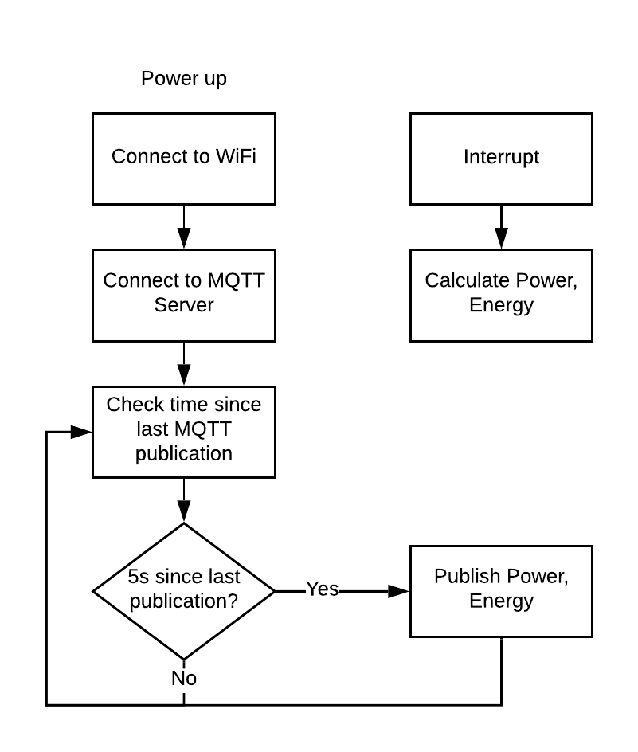
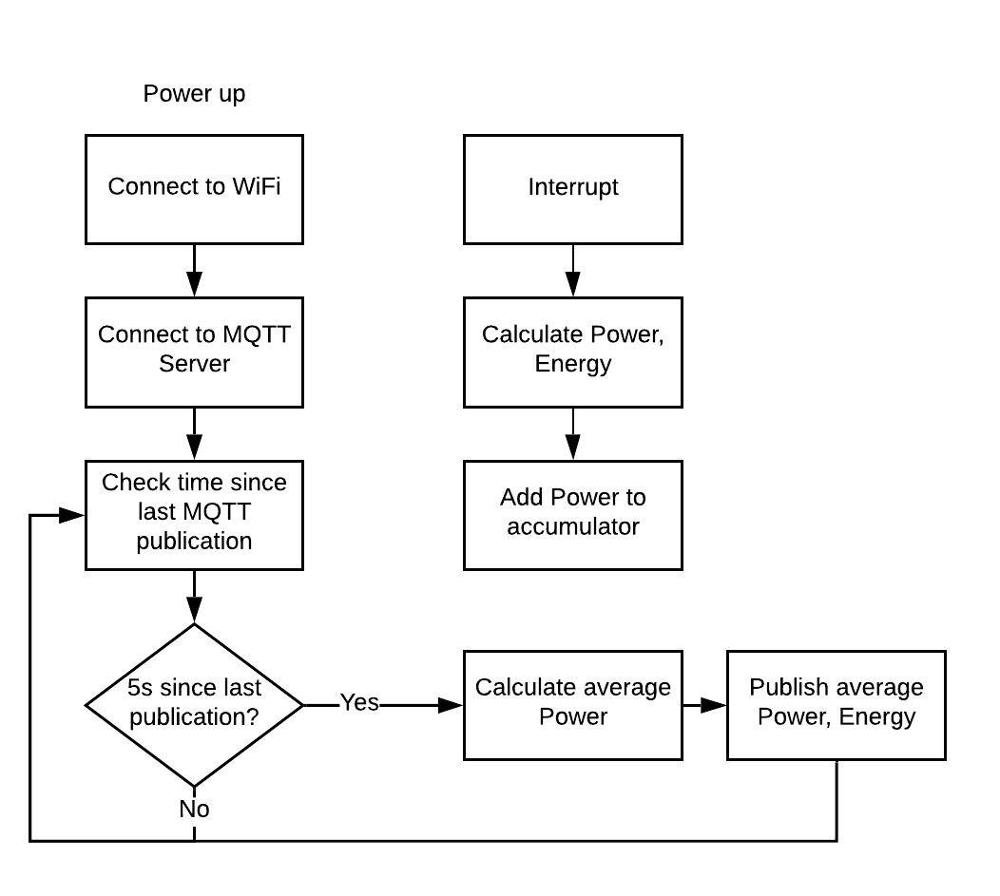

# esp8266-smart-meter

Monitoring electricity usage of a previously "smart" meter via esp8266, optical measurement and current measurement.

Hardware/software based on https://openenergymonitor.org/

## Requirements

1. esp8266 module (e.g. NodeMCU)
2. [Optical Monitor](https://shop.openenergymonitor.com/optical-utility-meter-led-pulse-sensor/)
3. [CT transformer](https://shop.openenergymonitor.com/100a-max-clip-on-current-sensor-ct/)
4. 22 Ohm resistor (for 3.3V)
5. 2 x 10k resistors
6. 10 uF capacitor

## v1

Simple timer-based circuit that publishes latest readings every 5 seconds.

## v2

Timer-based circuit that publishes average of all readings every 5 seconds.

Note this skews towards higher power readings as these interrupt at a higher frequency and will be represented more often in the accumulator.

