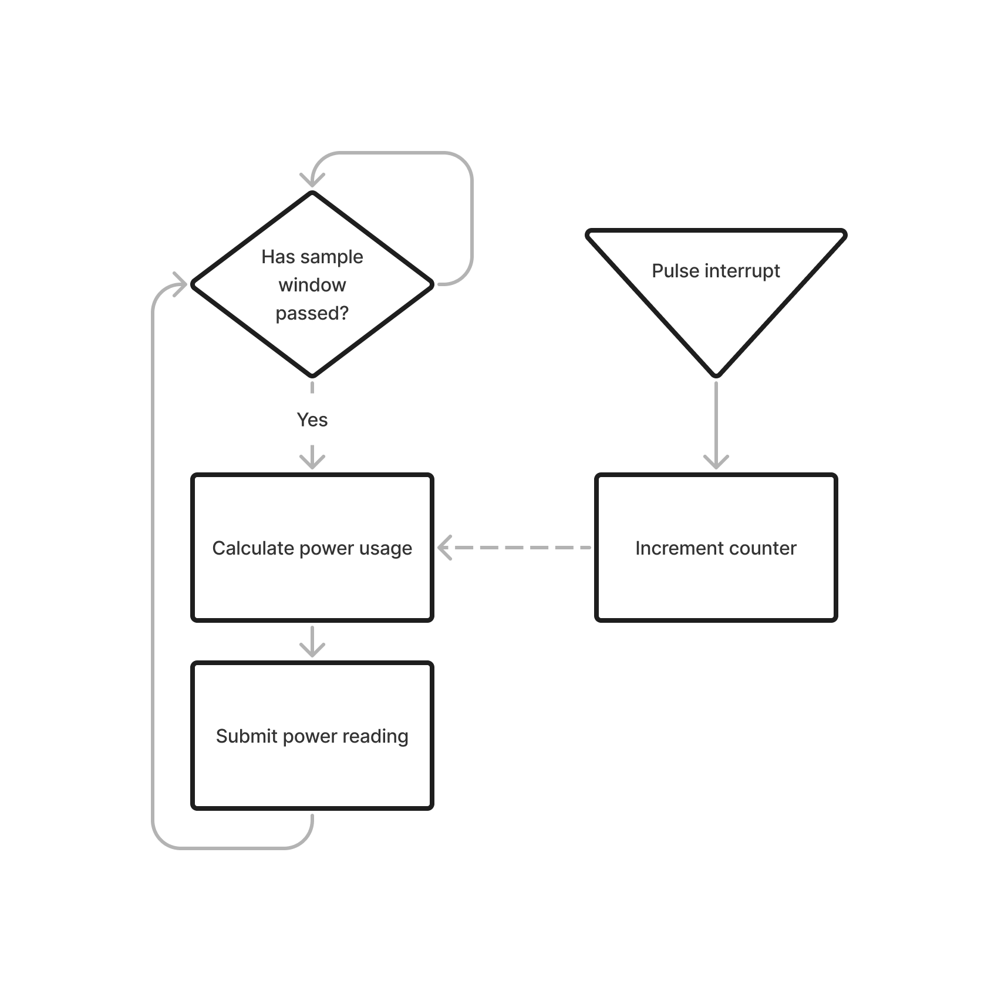

# esp8266-smart-meter

Monitoring electricity usage of a previously "smart" meter via esp8266 and optical measurement.

Hardware/software based on https://openenergymonitor.org/

This version uses the [optical readout of a smart meter](https://learn.openenergymonitor.org/electricity-monitoring/pulse-counting/introduction-to-pulse-counting); the [current transformer approach](https://learn.openenergymonitor.org/electricity-monitoring/ct-sensors/introduction) was too low fidelity and inaccurate by comparison.

## Requirements

1. esp8266 module (e.g. NodeMCU)
2. [Optical monitor](https://shop.openenergymonitor.com/optical-utility-meter-led-pulse-sensor/)

## Power calculations

Pulses are in units of pulses per kWh, and I have tested this sketch with two systems, one running at 1000 ppkWh and another at 3200 ppkWh.

Working in Wh we have 1 ppWh and 3.2 ppWh.

$$Wh = J/s * 60*60 s = 3600J$$

The resolution of the two systems (in Joules per pulse - Jpp) is therefore:

ppkWh|Jpp
---|---
1000|3600
3200|1125

### Power calculation method 1: instantaneous power

We measure the time between pulses `T` and calculate:

$$Power = Jpp / T$$

For a sensitive meter (3200 ppkWh) at max load (100A or 24kW), this would lead to a `T` of 47 ms. This may be shorter than the time required to make an MQTT publication.

For a basic meter (1000 ppkWh) with low usage (e.g. background of 60W), this would lead to a `T` of 60s.

For periods of no usage, no measurement of 0W will be taken at all.

Given that the MQTT/HA integration uses the last known value as its current value, we will need to use a sampling approach instead.

### Power calculation method 2: sampled power

We measure the number of pulses in a fixed time window, and calculate the average power over the time window.

This will account for low (or no) energy usage at 0W.

The resolution of our power reading is dependant on the resolution of the pulses and the sampling window used to measure how many pulses have occurred:

sampling window (s)|1000ppkWh resolution (W)|3200ppkWh resolution (W)
---|---|---
5|720|225
10|360|112.5
15|240|75
30|120|37.5
45|80|25
60|60|18.75

The sampling window can be calculate from the required resolution:

$$window = Jpp / resolution $$

e.g. For a 50W measurement resolution: $$ window = 3600 / 50  = 72 seconds $$
